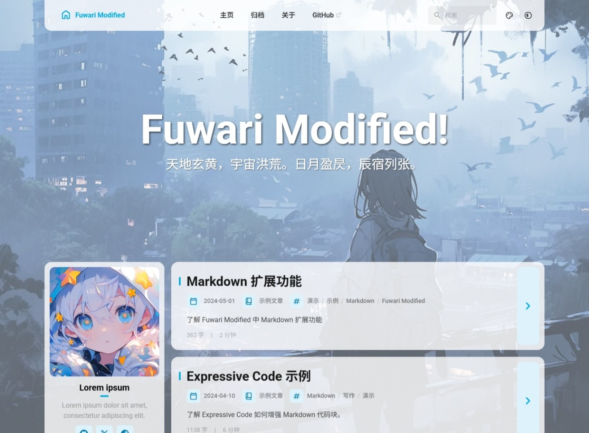

 

<table>
<tr>
<td valign="middle" align="center">

# 🍥 Fuwari-Modified

**基于 Fuwari 修改的 Astro 博客主题**

*保持优雅 · 技术焕新 · 功能增强*

</td>
<td valign="middle" align="left">

[**🖥️ 在线预览**](https://ancryel.github.io/fuwari-modified-demo)

[**📦 上游仓库**](https://github.com/saicaca/fuwari)

[**🐛 提交反馈**](https://github.com/ancryel/fuwari-modified/issues)

</td>
</tr>
</table>

 

<table>
<tr>
<td valign="middle" align="center">

</td>
<td valign="middle" align="center">

</td>
</tr>
</table>

 

📖 **README** · 简体中文 &nbsp;|&nbsp; [繁體中文](docs/README.zh-TW.md) &nbsp;|&nbsp; [English](README.en.md)

 

---

> [!TIP]
> 这是一款基于 [Astro](https://astro.build) 框架和 [Fuwari](https://github.com/saicaca/fuwari) 模板修改的博客主题。
>
> 项目中许多内容是 AI 翻译，如有不准欢迎提交 [Pull Request](https://github.com/ancryel/fuwari-modified/pulls) 修正。

## ✨ 功能特性

在保留 Fuwari 原版优雅设计与阅读体验的基础上，完成了以下修改与新增：

### &nbsp;&nbsp;技术焕新
- [x] 升级至 Astro v5
- [ ] 升级至 Astro v7
- [x] Svelte 替换为 Alpine.js
- [x] 升级至 Tailwind v4
- [ ] 升级至 TypeScript v6

### &nbsp;&nbsp;功能增强
- [x] 背景图 + 卡片透叠
- [x] 首页文字
- [x] 滚动进度条

## 📖 使用说明

| 项目 | 路径 |
|:---|:---|
| 站点配置 | `src/config.ts` |
| 文章 | `src/content/posts/` |
| 关于页 | `src/content/spec/about.md` |

> 更多内容（部署、主题定制、项目结构等）请参考 [原版 Fuwari README](https://github.com/saicaca/fuwari#readme)。

## 🙏 特别致谢

一切基于 [saicaca](https://github.com/saicaca) 开发的 [fuwari](https://github.com/saicaca/fuwari) 模板。

### &nbsp;&nbsp;技术栈

Astro 5 · Alpine.js 3 · Tailwind CSS 4 · TypeScript 5.9

Pagefind · Expressive Code · KaTeX · PhotoSwipe · Swup

### &nbsp;&nbsp;参考借鉴
- [fuwari](https://github.com/saicaca/fuwari), MIT 协议
- [Firefly](https://github.com/CuteLeaf/Firefly), MIT 协议 *（参考了首页文字功能）*
- [Mizuki](https://github.com/matsuzaka-yuki/Mizuki), MIT 协议 *（参考了背景图 + 卡片透叠功能）*

> `滚动进度条`功能的参考项目已找不到原始出处，如有知情者请[提交 Issue](https://github.com/ancryel/fuwari-modified/issues)告知。

## 📄 许可协议

遵循 [MIT License](https://mit-license.org/) 开源协议。

- 原项目版权：Copyright (c) 2024 saicaca (Fuwari)
- 修改部分版权：Copyright (c) 2026 ANcRyel (Fuwari-Modified)

详细条款见 [LICENSE](./LICENSE)。